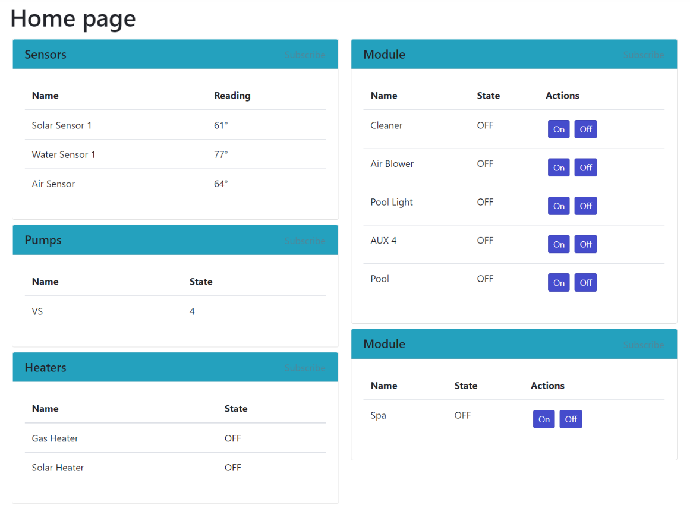
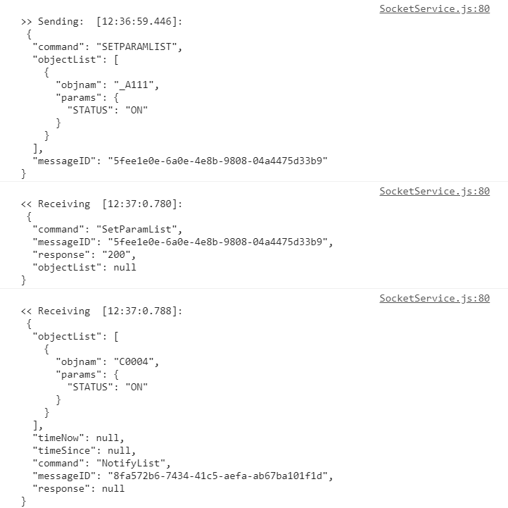
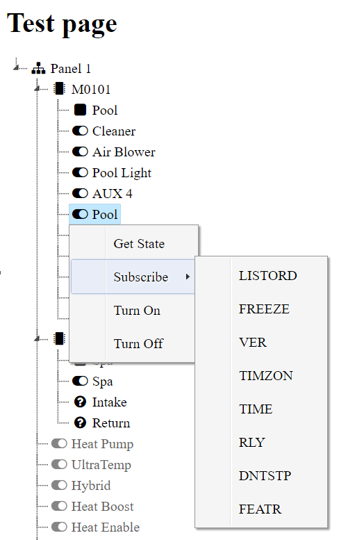

# IntelliCenter Gateway
Gateway to Pentair IntelliCenter Control System.

## Introduction
A website developed using [ASP.NET Core](https://github.com/dotnet/aspnetcore) that connects directly to an IntelliCenter to issue commands and subscribe to updates.

The website uses a [hosted service](https://docs.microsoft.com/en-us/aspnet/core/fundamentals/host/hosted-services) to connect to the IntelliCenter on the [Telnet](https://en.wikipedia.org/wiki/Telnet) protocol and send realtime data into a stream connected to [SignalR](https://docs.microsoft.com/en-us/aspnet/core/signalr/introduction).

This can then be used by any client using Javascript in the browser to issue commands and process responses received back from the IntelliCenter.

Ideally the website should be running continously and a good option for this is to use a  [Raspberry Pi](https://www.raspberrypi.org/products/) that is a low power device and has WiFi connectivity.

## Setup
Change the appsettings.json file to include the IP address of the IntelliCenter on your local network.

```JSON
"Configuration": {
    "TelnetHost": "192.168.1.10"
}
```

Website authentication has been included to allow secure remote access.  A section called `Users` contains usernames and passwords which will be validated during sign in.  It is essential that you change the default password (second string in green) to prevent unauthorized access.

```JSON
"Users": {
    "user": "user"
}
```

For third party applications bearer tokens are available and configured with `Token` section.  It is essential that you change the default signing key (must be 16 or more characters) that is used for encryption.

```JSON
"Token": {
    "Issuer": "localhost",
    "Audience": "localhost",
    "ValidFor": 3600,
    "SigningKey": "Supercalifragilisticexpialidocious"
}
```

## Docker
Clone repo and run.
```
docker build . -t intellicentergateway
docker run -it -p 8000:80 -e "Configuration__TelnetHost=192.168.1.100" intellicentergateway
```

## Operation
Once the website is running the home page should be shown after signing in.  Javascript on the page should connect to SignalR on the server and send a command to request the hardware definition of your IntelliCenter.

The resulting message is processed and a filtered set of objects are displayed on the page.  For circuits they can then be turned on/off and for probes you can subscribe to temperature updates.



A posting at [Trouble Free Pool](https://www.troublefreepool.com/threads/intellicenter-home-automation-integration-and-control.186856/post-1658889) details other example commands.  You can also discover commands by going to the https://intellicenter.com/ website and inspecting the messages that are shown in the debugging console, example below.



## Playground
A [test webpage](https://github.com/mguinness/IntelliCenterGateway/blob/master/IntelliCenterGateway/wwwroot/test.html) using jQuery and jsTree to display all the objects returned from the IntelliCenter.  This demonstrates issuing commands like getting object state, subscribing to parameters and turning circuits on and off.  Using this as a reference point it makes it possible to create a customized dashboard with any Javascript framework.



## Credits

A simple task-based event-driven Telnet client
https://github.com/Spksh/TentacleSoftware.Telnet/

A SignalR ASP.NET Core server broadcast example
https://github.com/JakeDixon/server-broadcast-signalr-dotnetcore/

ASP.NET Core 3.1 Razor Pages cookie sample
https://github.com/dotnet/AspNetCore.Docs/tree/master/aspnetcore/security/authentication/cookie/samples/3.x/CookieSample

ASP.NET Core 2.2 JWT bearer sample
https://github.com/blowdart/CookieJwtBearerSample/tree/master/CookieJwtBearer

THIS SOFTWARE IS PROVIDED AS IS, NO WARRANTY, NO LIABILITY. NEITHER AUTHOR NOR ANYONE ELSE ARE RESPONSIBLE FOR ANY DAMAGE THAT COULD BE CAUSED BY THIS SOFTWARE. USE AT YOUR OWN RISK.